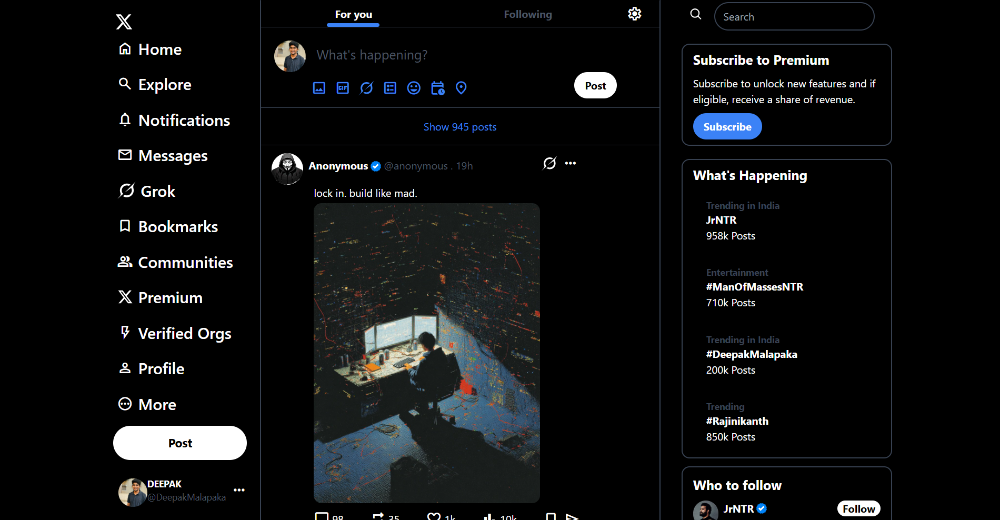
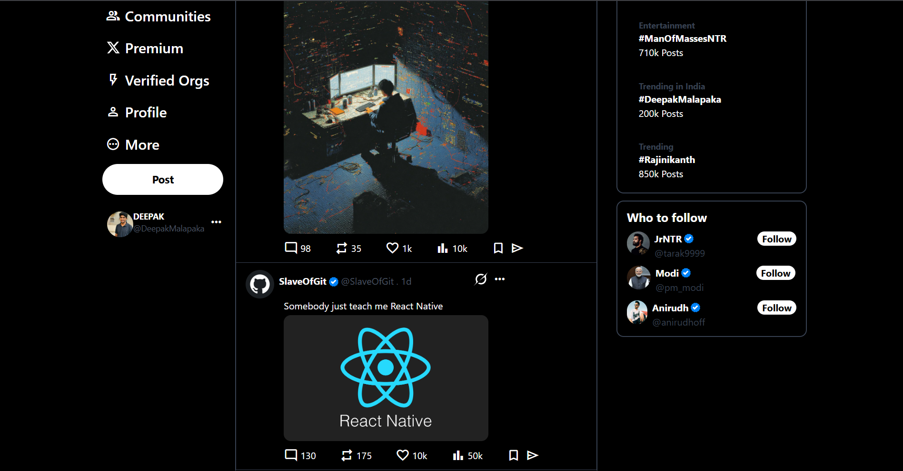

# X Clone (Twitter UI Clone) - Tailwind CSS Project

This is a clone of the X (formerly Twitter) web interface, built entirely using **HTML** and **Tailwind CSS**. The project is focused on replicating the layout and design elements of X to improve my skills in responsive UI design and Tailwind utility classes.

# Preview 1

# Preview 2

## 🚀 Features

- 📌 Sidebar with navigation (Home, Explore, Notifications, Messages, etc.)
- 🌐 Central feed layout (For You & Following tabs)
- 🧾 Post section with interaction buttons (comment, like, views, share)
- 🔍 Trending section & Who to follow sidebar
- 💡 Fully responsive layout using Tailwind CSS
- 🌙 Dark mode themed UI
- ✅ Clean, organized HTML structure with utility-first styling

## 🛠️ Technologies Used

- HTML5
- [Tailwind CSS](https://tailwindcss.com/)
- Google Fonts (for material icons)

## 📁 Project Structure

X-CLONE/
├── assets/
│ ├── images/ # Profile pics & icons
│ └── ScreenShots/ # Project screenshots for README
├── node_modules/
├── src/
│ ├── input.css # Tailwind input
│ └── output.css # Generated Tailwind output
├── index.html
├── package.json
├── tailwind.config.js
├── README.md
